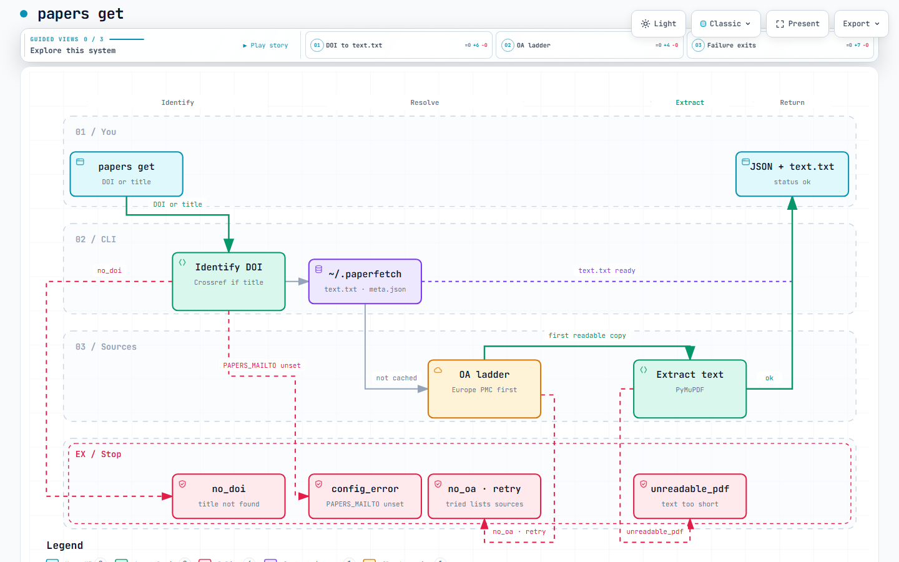

# paperfetch-oa

Get a paper's **open-access** full text from a DOI or a title.

Install it, set your email, run `papers get`. It looks through public sources, saves a PDF plus plain text on your machine, and prints one JSON object so you know what happened.

It only fetches copies that are already open. It does not log in anywhere.

Python 3.10+.

## Install

```
pip install git+https://github.com/bartholomewtj/paperfetch-oa.git
```

Or from a clone:

```
pip install -e .
```

If the `papers` command is not on your PATH, use `python -m papers` instead.

## Set your email

Unpaywall, OpenAlex, and Crossref require a real contact address. Do not use a made-up one.

macOS / Linux:

```
export PAPERS_MAILTO="you@your-domain"
```

Windows PowerShell:

```
$env:PAPERS_MAILTO="you@your-domain"
```

## Get a paper

```
papers get 10.1371/journal.pone.0000308
papers get "Sharing detailed research data is associated with increased citation rate"
```

Several at once, or a file of DOIs / titles (one per line):

```
papers get 10.1371/journal.pone.0000308 10.1001/jamapsychiatry.2018.1776
papers get - < dois.txt
```

A title is resolved through Crossref first (`resolved title -> {doi}` on stderr). Prefer a DOI when you have one — titles are fuzzy. Title lookup skips preprints and reviewer reports, and prefers a journal article.

`papers get` prints one JSON object per input, in input order. Exit code is 0 when every line is `ok`. One input that is not `ok` exits 1 (`no_doi`, `config_error`) or 2 (the rest). A batch of mixed results exits 2.

Read the file at `read`, not the PDF.

```
{
  "status": "ok",
  "doi": "10.1371/journal.pone.0000308",
  "title": "Sharing Detailed Research Data Is Associated with Increased Citation Rate",
  "resolver": "europepmc",
  "read": "/home/you/.paperfetch/cache/10.1371%2Fjournal.pone.0000308/text.txt",
  "text_chars": 8432,
  "agent_next": "read_text; cite_doi_and_version; do_not_attach_pdf"
}
```

Check the local cache (no network):

```
papers status
```

## How it works

[](https://bartholomewtj.github.io/paperfetch-oa/pipeline.html)

*[Open the interactive diagram](https://bartholomewtj.github.io/paperfetch-oa/pipeline.html)* — pan, zoom, and three views: DOI to text.txt, OA ladder, and failure exits.

1. **Identify.** A `10.…` token is a DOI. Anything else goes to Crossref. Missing `PAPERS_MAILTO` is `config_error`.
2. **Cache.** Hits live under `~/.paperfetch` (Windows: `%USERPROFILE%\.paperfetch`). A readable `text.txt` already there is returned as `ok` with no download.
3. **OA ladder.** First readable copy wins: Europe PMC → US PMC → bioRxiv / medRxiv → Unpaywall → OpenAlex → Semantic Scholar → preprint URL shortcuts → CORE (only with a key).
4. **Extract.** PyMuPDF turns the PDF into `text.txt`. Europe PMC XML and PMC HTML write the same shape.
5. **Return.** JSON on stdout. Files stay in the cache for the next run.

US PMC also reads the article page when PMC has no downloadable PDF — that is how NIH author manuscripts come back as text. For `10.1101/` preprints, the bioRxiv / medRxiv step asks Cold Spring Harbor which server holds the paper and which version is newest, then fetches that PDF.

Unpaywall tries every open location it knows, repository copies before publisher sites. A failed download or a PDF with no extractable text moves on to the next location, then the next resolver, rather than stopping.

## What you get

Each cached paper is a folder:

| File | Contents |
|---|---|
| `paper.pdf` | The downloaded file |
| `text.txt` | Extracted text, section markers |
| `meta.json` | Title, resolver, version, license, `sections` |

`text.txt` puts a marker line before every standard section it found, then a blank line, then the section's text:

```
## Introduction

Sharing information facilitates science. ...

## Results

Of the 85 publications, ...
```

The standard sections are `abstract`, `introduction`, `methods`, `results`, `discussion` and `conclusions`. Title, authors and anything before the first heading stay at the top with no marker. Other headings ("Genotyping", "Patient characteristics") stay in the body under the nearest marker. The reference list, acknowledgements, funding, supporting-information lists and repeated page headers and footers are dropped.

`meta.json` records what was found as `"sections": ["introduction", "results", "discussion", "methods"]` (lowercase, in document order). A PDF with no detectable headings still extracts as plain text, with no markers and `"sections": []`.

Headings are found by font: a line that names a standard section and is larger than the body text, bold, or in capitals.

## Statuses

| Status | Meaning |
|---|---|
| `ok` | Full text on disk. Read the file at `read`. |
| `no_oa` | No open-access copy found. `tried` lists the resolvers. `unpaywall_blocked` means the publisher PDF refused a script. |
| `unreadable_pdf` | Got a PDF, no extractable text (likely a scan). |
| `retry` | Unpaywall was unreachable and nothing else hit. Try later. |
| `no_doi` | Title did not resolve to a DOI. |
| `config_error` | Bad setup, such as no `PAPERS_MAILTO`. `reason` says what to fix. |

A usage error always prints JSON on stdout (`status: "config_error"`) and exits 1.

## Optional keys

Neither is required.

- `SEMANTIC_SCHOLAR_API_KEY` — higher Semantic Scholar rate limits. Without a key, a 429 skips that resolver for the rest of the process. Never commit keys.
- `CORE_API_KEY` — adds [CORE](https://core.ac.uk/services/api) as the last resolver. Register free at https://core.ac.uk/api-keys/register. Without a key CORE is skipped.

A batch (`papers get` with several inputs, or `papers get -`) keeps those skip/error memos for the whole run, so a keyless Semantic Scholar 429 sleeps once, not once per DOI.

## What this will not do

- Fetch a paywalled publisher PDF
- Log in to a publisher, library, or campus proxy
- OCR a scanned PDF that has no text layer
- Invent a DOI for a title Crossref does not know

Give a DOI when you have one.

## Tests

```
python -m pytest -q
```

Offline only. No network, no keys.

## License

MIT.
